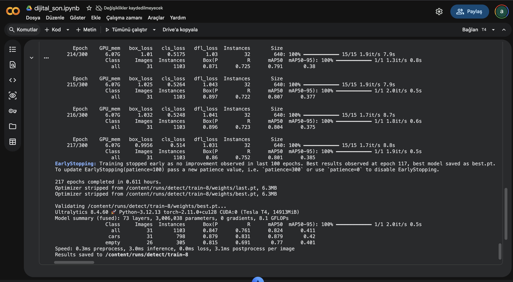
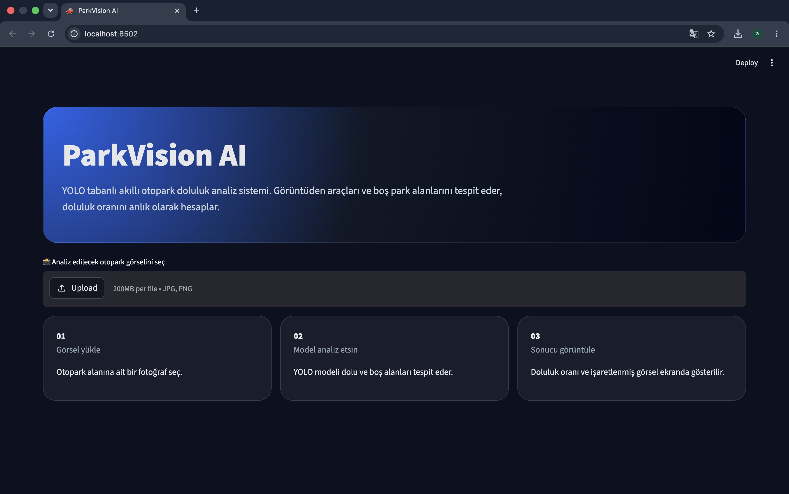
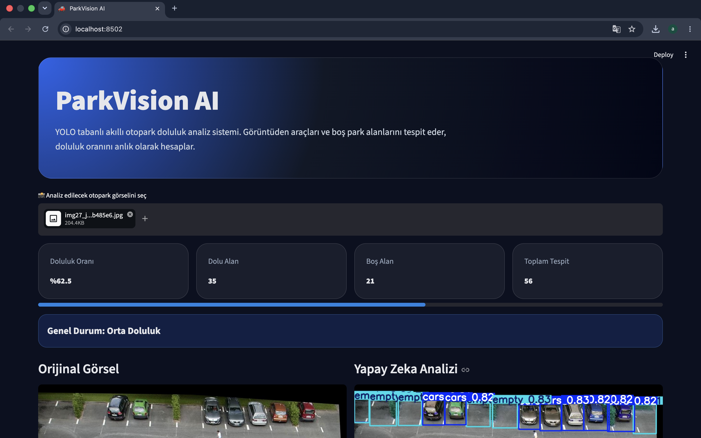
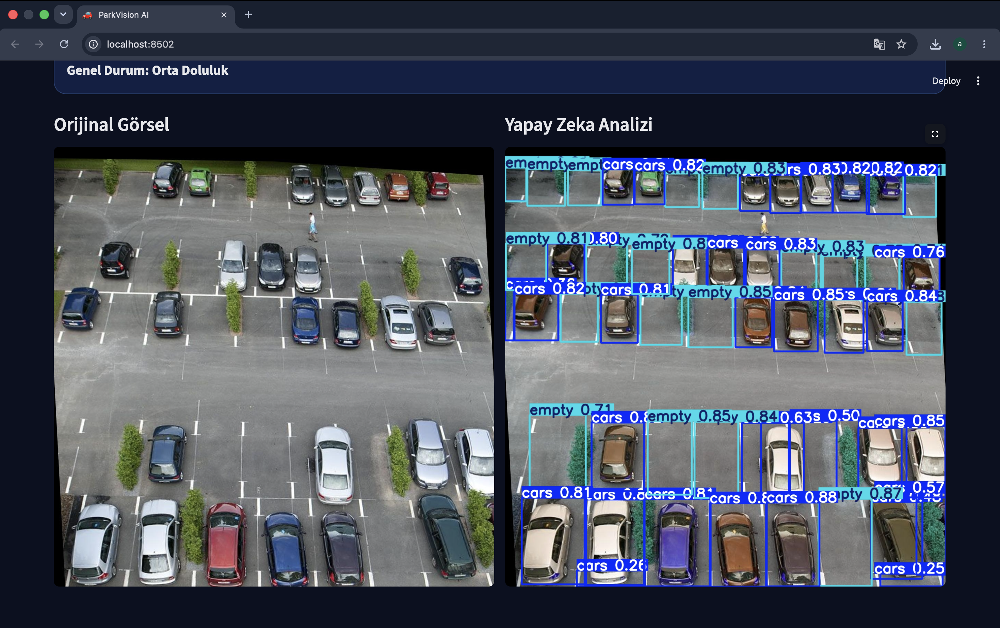
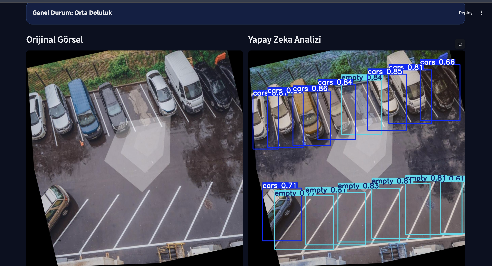
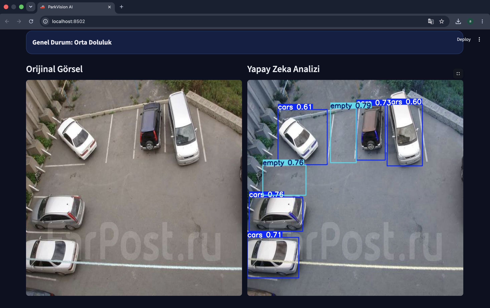
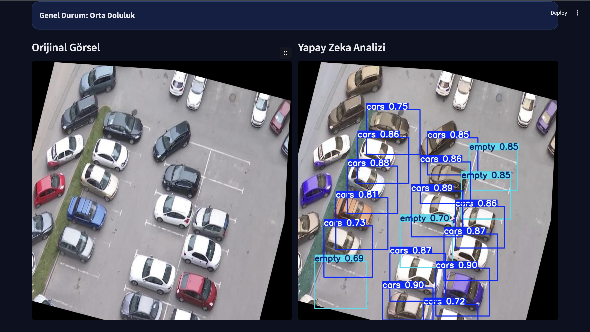
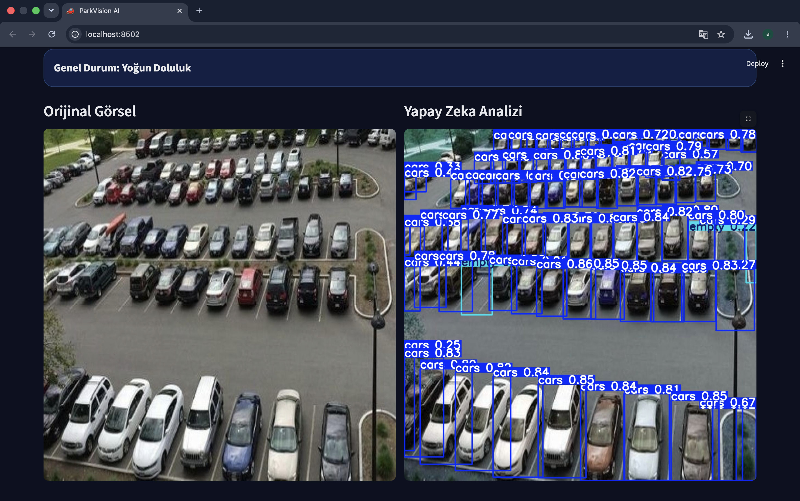
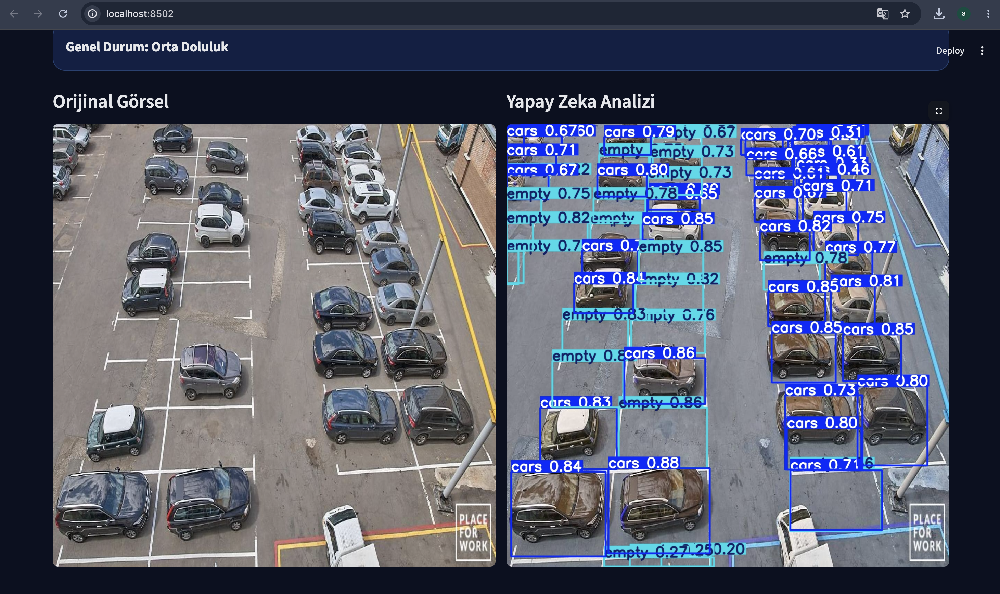

# ParkVision AI

## Proje Hakkında

ParkVision AI, görüntü işleme ve derin öğrenme teknolojileri kullanılarak geliştirilmiş akıllı otopark doluluk analiz sistemidir. Proje kapsamında YOLOv8 nesne tespit modeli kullanılarak otopark görüntülerindeki araçlar ve boş park alanları tespit edilmekte, elde edilen sonuçlar doğrultusunda otoparkın doluluk oranı otomatik olarak hesaplanmaktadır.

Günümüzde büyük otopark alanlarının manuel olarak takip edilmesi zaman kaybına ve verimsizliğe neden olmaktadır. Bu proje ile birlikte otopark doluluk durumunun görüntüler üzerinden otomatik olarak analiz edilmesi amaçlanmıştır. Sistem kullanıcı tarafından yüklenen bir görüntüyü işleyerek dolu ve boş park alanlarını belirlemekte, ardından doluluk oranını hesaplayarak kullanıcıya görsel ve sayısal olarak sunmaktadır.

---

## Projenin Amacı

Bu projenin temel amacı, yapay zeka destekli görüntü işleme teknikleri kullanarak otopark doluluk analizini otomatik hale getirmektir.

Proje kapsamında;

- Araçların otomatik olarak tespit edilmesi,
- Boş park alanlarının belirlenmesi,
- Otopark doluluk oranının hesaplanması,
- Kullanıcı dostu bir arayüz geliştirilmesi,
- Gerçek zamanlı analiz yapılabilmesi

hedeflenmiştir.

---

## Kullanılan Teknolojiler

Projenin geliştirilmesi sırasında aşağıdaki teknolojilerden yararlanılmıştır:

| Teknoloji | Kullanım Amacı |
|------------|----------------|
| Python | Temel programlama dili |
| YOLOv8 | Nesne tespit modeli |
| Ultralytics | YOLOv8 model yönetimi |
| OpenCV | Görüntü işleme işlemleri |
| NumPy | Sayısal işlemler |
| Pillow (PIL) | Görüntü okuma ve dönüştürme |
| Streamlit | Web arayüzü geliştirme |
| Google Colab | Model eğitimi |

---

## Veri Seti ve Model Eğitimi

Proje kapsamında kullanılan veri seti iki farklı sınıftan oluşmaktadır:

- cars (araç)
- empty (boş park alanı)

Veri seti aşağıdaki klasör yapısına göre hazırlanmıştır:

```text
train/
├── images
└── labels

valid/
├── images
└── labels

test/
├── images
└── labels
```

Etiketleme işlemleri YOLO formatında gerçekleştirilmiş ve veri seti eğitim, doğrulama ve test olmak üzere üç farklı bölüme ayrılmıştır.

Model eğitimi Google Colab ortamında gerçekleştirilmiştir.



Eğitim sürecinde YOLOv8 mimarisi kullanılmıştır. Eğitim tamamlandıktan sonra elde edilen en başarılı model ağırlıkları best.pt dosyası olarak kaydedilmiş ve web uygulamasına entegre edilmiştir.

---

## Sistem Mimarisi

Sistem aşağıdaki çalışma mantığına sahiptir:

1. Kullanıcı sisteme bir otopark görüntüsü yükler.
2. Görüntü Streamlit arayüzü üzerinden alınır.
3. Görüntü YOLOv8 modeline gönderilir.
4. Model araç ve boş park alanlarını tespit eder.
5. Tespit sonuçları görüntü üzerine işlenir.
6. Araç ve boş alan sayıları hesaplanır.
7. Doluluk oranı hesaplanır.
8. Sonuçlar kullanıcı arayüzünde görüntülenir.

---

## Kullanıcı Arayüzü

Proje kapsamında kullanıcıların sistemi kolay kullanabilmesi amacıyla modern ve kullanıcı dostu bir web arayüzü geliştirilmiştir.

Sistemin başlangıç ekranı aşağıda gösterilmektedir.



Kullanıcı bu ekran üzerinden analiz etmek istediği otopark görüntüsünü sisteme yükleyebilmektedir.

---

## Analiz Sonrası İstatistik Paneli

Görüntü analizi tamamlandıktan sonra sistem aşağıdaki bilgileri kullanıcıya sunmaktadır:

- Doluluk oranı
- Dolu alan sayısı
- Boş alan sayısı
- Toplam tespit edilen alan sayısı
- Genel durum bilgisi



Bu sayede kullanıcı otoparkın mevcut durumunu hızlı bir şekilde değerlendirebilmektedir.

---

## Test Sonuçları

Sistem farklı yoğunluk seviyelerine sahip otopark görüntüleri üzerinde test edilmiştir.

### Test Sonucu 1



Bu örnekte sistem orta doluluk seviyesine sahip bir otoparkı başarıyla analiz etmiş ve dolu ile boş alanları doğru şekilde tespit etmiştir.

### Test Sonucu 2



Farklı kamera açıları altında gerçekleştirilen testlerde de model başarılı sonuçlar üretmiştir.

### Test Sonucu 3



Sistem tarafından 5 dolu ve 2 boş park alanı tespit edilmiş, otoparkın doluluk oranı %71,4 olarak hesaplanmıştır. Analiz sonucunda otopark orta doluluk seviyesinde değerlendirilmiştir.

### Test Sonucu 4



Boş ve dolu alanların birlikte bulunduğu karmaşık görüntüler üzerinde yapılan analiz sonucu.

### Test Sonucu 5



Farklı perspektiflerden alınan görüntülerde modelin performansı gözlemlenmiştir.

### Test Sonucu 6



Geniş otopark alanlarında gerçekleştirilen test sonuçları.

---

## Doluluk Oranı Hesaplama Yöntemi

Doluluk oranı aşağıdaki formül kullanılarak hesaplanmaktadır:

Doluluk Oranı = (Dolu Alan Sayısı / Toplam Alan Sayısı) × 100

Örneğin;

- Dolu alan sayısı: 35
- Boş alan sayısı: 21
- Toplam alan sayısı: 56

Doluluk Oranı = (35 / 56) × 100 = %62.5

Sistem elde edilen sonuca göre aşağıdaki durumları oluşturmaktadır:

| Doluluk Oranı | Durum |
|--------------|---------|
| %0 - %49 | Uygun Kapasite |
| %50 - %79 | Orta Doluluk |
| %80 ve üzeri | Yoğun Doluluk |

---

## Kurulum

Projeyi çalıştırmak için gerekli kütüphaneler aşağıdaki komut ile kurulabilir:

```bash
pip install -r requirements.txt
```

---

## Çalıştırma

### Yöntem 1

Windows kullanıcıları doğrudan:

```text
calistir.bat
```

dosyasına çift tıklayarak projeyi çalıştırabilirler.

### Yöntem 2

Terminal üzerinden:

```bash
streamlit run app.py
```

komutu çalıştırılarak sistem başlatılabilir.

---

## Proje Dizini

```text
OTOPARK_DOLULUK_TESPIT/
│
├── images/
├── train/
├── valid/
├── test/
├── app.py
├── best.pt
├── data.yaml
├── calistir.bat
├── requirements.txt
└── README.md
```

---

## Projenin Katkıları

Bu proje sayesinde;

- Otopark doluluk analizi otomatik hale getirilmiştir.
- Yapay zeka destekli nesne tespiti başarıyla uygulanmıştır.
- Kullanıcı dostu bir web arayüzü geliştirilmiştir.
- Gerçek zamanlı analiz yapılabilen bir sistem oluşturulmuştur.
- Farklı otopark görüntülerinde başarılı sonuçlar elde edilmiştir.

---

## Geliştiriciler

- Ayşe Buçak
- Merve Sarı
